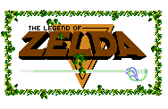
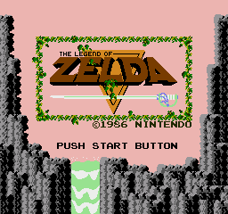
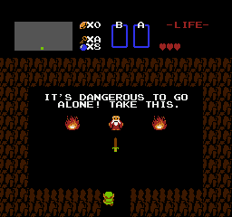
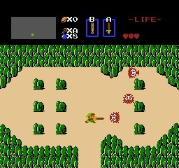
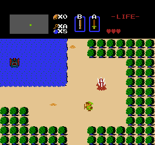
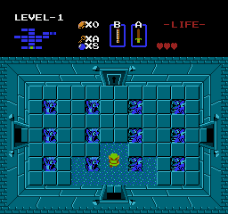
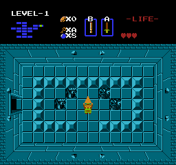

# The Legend of Zelda: Recréé

Ceci est mon projet personnel où j'essaye de recréer le jeu de NES de 1986: The Legend of Zelda. Je n'utilise que SDL, et je n,ai que accès au graphiques et sons du jeu original. Tout le code et la génération du monde sont faits manuellement par moi.

CECI N'EST PAS UN ÉMULATEUR! Le jeu est recréé manuelement, et ne performe aucunement la même logique que dans le jeu original. Je n,ai pas utilisé le code source 6502 comme référence. Seulement ma copie du jeu que j'ai pour ma NES.

Mon but est d'être le plus proche possible au jeu original, mais sans se soucier sur les petits détails. Si le jeu joue et semble comme l'original, c'est assez bon.

Les commentaires de code sont en anglais parce que je n'ai pas envie de tous les changer.

## Techniques Utilisés

Pour me simplifier la vie sur les positions exactes de toutes les graphiques sur l'écran, j'ai créé un système pour dessiner le jeu à l'écran qui est très similaire à la manière que la NES dessine ses jeux. Mon "VRAM" consiste d'un tableau 2x2 écrans de large, où chaque écran est 32 tuiles de large et 30 tuiles de haut. La taile de 2 écrans de chaque bord permet d'avoir du "scrolling" comme dans le jeu original. Chaque tuile est 8x8, ce qui donne la résolution originale du jeu de 256x240. Comme la console originale, chaque tuile ne fait que contenir un index dans un tableau de différent graphiques que le jeu peux utiliser, ainsi q'une index dans une liste de 4 palettes de couleure que la tuile peut utiliser.

Les "sprites" fonctionnent aussi d'une façon similaire à la console originale. Ils sont indépendant des tuiles d'arrière plan, et son soit dessinés par dessus ou par dessous à une position relative à l'écran. De plus, ils ont aussi l'option d'avoir un effet miroir sur leur tuile de référence, sois dans une direction horizontale, verticale, ou les deux.

Par contre, je me suis quand même laissé quelques libertés. La NES a une limite de 64 "Sprites" qui peuvent être à l'écran à la fois, et de plus, il ne peut pas y avoir plus de 8 à la même hauteure verticale. Ces deux limites ne se trouvent pas dans mon jeu, car il's n'ont rien à faire avec la façon que le jeu est perçu.

## Contrôles

Ce projet n'est pas fini, et donc est toujours en mode débogguage. Cela se peut que certaines choses soit un peu différentes pour pouvoir facilement tester des intéractions entre plusieurs objets.

Contrôles de manette NES:

- WASD: D-pad
- J: B
- K: A
- G: Select
- H: Start

Contrôles de débogguage:

- R: Recommencer la console
- .: Avancer une image
- P: Mettre la console en pause / Enlever le mode pause
- Tab (maintenir): Enlever le cap de 60fps
- F1: Prendre une capture du jeu
- Échapp: Quitter le jeu

Le jeu s'ouvre par défaut à une résolution de 2:1 (512x480), mais la fenêtre peut changer de taille sans problèmes. Aussi, les sauvegardes se font automatiquement, mais seulement quand l'option "SAVE" est sélectionnée sur l'écran de mort.

## Images du Jeu

